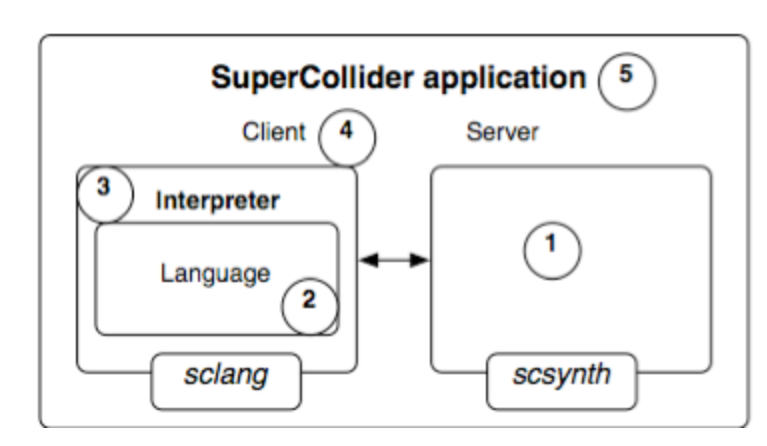

# Sesión 3
__Miércoles 27 de Agosto, 2025__  
__Lugar: Zoom__

## **Temas Revisados**
En esta sesión, profundizamos en conceptos esenciales de programación dentro del entorno de SuperCollider, con un enfoque en la aplicación musical. Los temas centrales fueron:

1.  **Variables y Argumentos:**
    *   Diferenciación entre **variables** (etiquetas que almacenan valores) y **argumentos** (parámetros de entrada para funciones).
    *   **Alcance (scope)** de las variables: entendiendo en qué parte del código una variable es visible y puede ser utilizada. Se explicó mediante la analogía de contextos o "universos" (global, local dentro de una función).

2.  **Arreglos (Arrays) y Colecciones:**
    *   Los arreglos son **colecciones ordenadas de elementos** (números, strings, otros arreglos, etc.), definidos entre corchetes `[ ]`.
    *   **Arreglos multidimensionales:** Creación y acceso a arreglos anidados (ej: `arreglo[0][1]` para acceder al segundo elemento del primer arreglo interno).

3.  **Estructuras de Control y Lógica Booleana:**
    *   **Operadores de comparación:** `==` (igual), `>` (mayor), `<` (menor), `!=` (diferente). Devuelven valores **booleanos** (`true`/`false`).
    *   **Operadores lógicos:** `&&` (AND, devuelve `true` solo si ambos operandos son `true`), `||` (OR, devuelve `true` si al menos un operando es `true`).
    *   **Estructura condicional `if`:** Permite bifurcar la ejecución del código basedo en una condición booleana. Se puede combinar con `else` para definir una acción alternativa.

4.  **Iteración con `do`:**
    *   El método `.do` aplica una función a cada elemento de una colección o un número específico de veces. Es fundamental para automatizar procesos.
    *   Se recalcó la importancia del **orden de ejecución** dentro de los bloques de iteración para obtener los resultados deseados.

5.  **Introducción al Servidor de Sonido y Síntesis:**
    *   **Arquitectura Cliente-Servidor:** SuperCollider separa el lenguaje (cliente) del motor de sonido (servidor). Se debe bootear el servidor (`Ctrl+B`) para generar audio.

    

    *   **Ejecución de un Sintetizador (`Synth`):** Se creó un sonido básico y se vio la necesidad de liberarlo de la memoria manualmente con `.free` para que deje de sonar.

6.  **Introducción a las [Rutinas](https://doc.sccode.org/Classes/Routine.html):**
    *   Las **rutinas** permiten controlar el tiempo dentro del código, pausando la ejecución con `.wait`.
    *   Son esenciales para secuenciar eventos sonoros en el tiempo (ej: tocar notas con una duración específica).

#### **Ejercicios Prácticos Revisados**
Los estudiantes compartieron sus avances en la tarea de la semana, mostrando ejercicios donde aplicaron estos conceptos:

*   **Noemí:** Cálculo de frecuencias a partir de períodos orbitales de planetas, aplicando escalas para adaptarlas al rango audible y conversión a notas MIDI.

*   **Andrés:** Generación de melodías aleatorias usando la escala hexáfona (seleccionando notas pares), asignando dinámicas y ritmos también aleatorios.

*   **Constanza y Gabriel:** Exploración de diferentes técnicas para manejar y seleccionar series o escalas predefinidas, iterando sobre ellas y manejando la lógica para múltiples instrumentos.

#### **Recursos y Materiales Mencionados**

*   **Repositorio de la Clase:** [Archivo de SuperCollider Sesión 3 (.scd)](../assets/scd/sesion03.scd)  
*   **Documentación de SuperCollider:** No duden en utilizar la ayuda interna (`Ctrl+D`) para entender métodos como `.do`, `.choose`, `.collect`, etc.
*   **ChatGPT:** Herramienta de apoyo para resolver dudas específicas de sintaxis y descubrir métodos como `select`, `collect`, siempre que se use para comprender y no solo para copiar código.
*   **Grabación de la sesión 3** Disponible en este [link](https://www.youtube.com/watch?v=DxLyC3oydzs&list=PL7lm0VTw8-QE7YSEg_A0puKEIanOK_7wh&index=3)

#### **Tarea Asignada**
Basándose en los conceptos vistos, especialmente en el uso de **rutinas** y el control del **tiempo**, la tarea para la siguiente sesión es:

**"Composición de una Escala Acelerada"**

1.  Escribir una rutina que reproduzca una escala cromática ascendente (36 notas).
2.  La ejecución debe **acelerarse gradualmente**. Esto significa que la duración (`wait`) entre cada nota debe disminuir a medida que avanza la escala.
3.  **Utilizar obligatoriamente la función de conversión de MIDI a frecuencia** (`midicps` o la función personalizada que crearon en tareas anteriores) para calcular la frecuencia de cada nota.
4.  **Variable dinámica:** La frecuencia de la nota debe incrementarse en cada paso de la iteración.
5.  **(Opcional)** Experimentar modificando otros parámetros del sonido (amplitud, timbre) o utilizando notas aleatorias dentro de una escala once dominen la parte fundamental.

