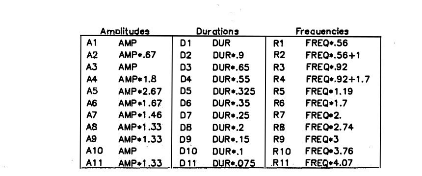

# **Clase 8 | Síntesis Espectral y Procesamiento Espacial**

## **Introducción**
En esta sesión retomamos los conceptos fundamentales del análisis espectral para aplicarlos en técnicas de síntesis de sonido y explorar principios básicos de procesamiento espacial. Partimos de los fundamentos revisados en la clase anterior para adentrarnos en la creación sonora mediante síntesis aditiva y la manipulación del espacio acústico.

---

## **Temas Revisados**

### **1. Síntesis Aditiva y Modelado de Sonidos**
- **Fundamentos de la síntesis aditiva:** Composición de sonidos complejos mediante la suma de ondas sinusoidales.
- **Modelado de sonidos naturales:** Aplicación de tablas de amplitudes, frecuencias y duraciones para emitar sonidos como campanas.
- **Ejemplo práctico:** Implementación en SuperCollider de un modelo de campana basado en estudios de Jean-Claude Risset.

### **2. Parámetros de la Síntesis Aditiva**
- **Amplitudes y envolventes:** Control individual de la evolución temporal de cada parcial.
- **Frecuencias parciales:** Uso de relaciones no armónicas para generar sonidos complejos.
- **Duración de parciales:** Manejo de envolventes independientes para cada componente espectral.

### **3. Procesamiento Espacial del Sonido**
- **Panorámica (pan):** Colocación de sonidos en el campo estéreo.
- **Limitaciones perceptivas:** Diferencias en la resolución espacial para frecuencias graves y agudas.
- **Técnicas de espacialización:** Uso de diferencias de tiempo y filtros para crear ilusiones de movimiento.

---

## **Ejercicio Práctico en clase: Síntesis de una Campana**

### **Objetivo**
Implementar en SuperCollider un sintetizador de campana utilizando síntesis aditiva, basado en modelos espectrales predefinidos.

### **Parámetros del Modelo**
- **Frecuencias parciales:** Relaciones no armónicas (ej: 0.56, 0.92, 1.19, etc.).
- **Amplitudes relativas:** Valores preestablecidos para cada parcial.
- **Envolventes independientes:** Control de duración y forma para cada componente.

## **Ejercicio de Composición | Tarea**

### **Instrucciones**
Crea una pieza breve utilizando únicamente sonidos de campana sintetizados:
- Varía parámetros de frecuencia, duración y amplitud
- Experimenta con posicionamiento espacial
- Utiliza rutinas para crear patrones temporales

---

## **Recursos y Referencias**

### **Material de la Clase**
* **Grabación de la sesión 8**: [Enlace al video](https://youtu.be/NNnCq4CaltI?si=UWCC4mEZtGzOItAY)
* **Tablas de parámetros**: Referencias de modelos de Risset

### **Lecturas Recomendadas**
- *Computer Music Tutorial* by Curtis Roads
- *Spectral Music* by Joshua Fineberg
- *[Computer music. Synthesis, composition and performance](../assets/pdf/ComputerMusicCharlesDodge.pdf)* by Charles Dodge and Thomas A. Jerse.
- Documentación de SuperCollider sobre síntesis aditiva

